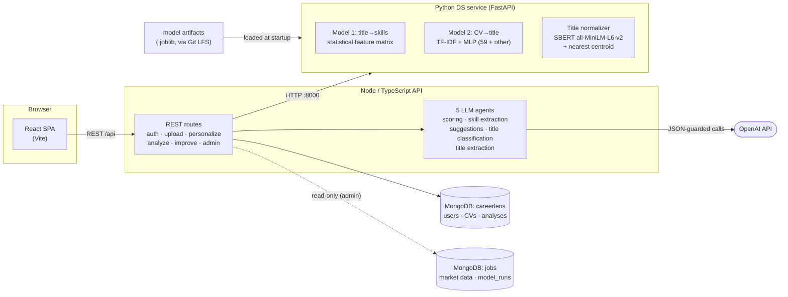
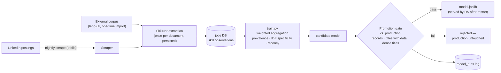
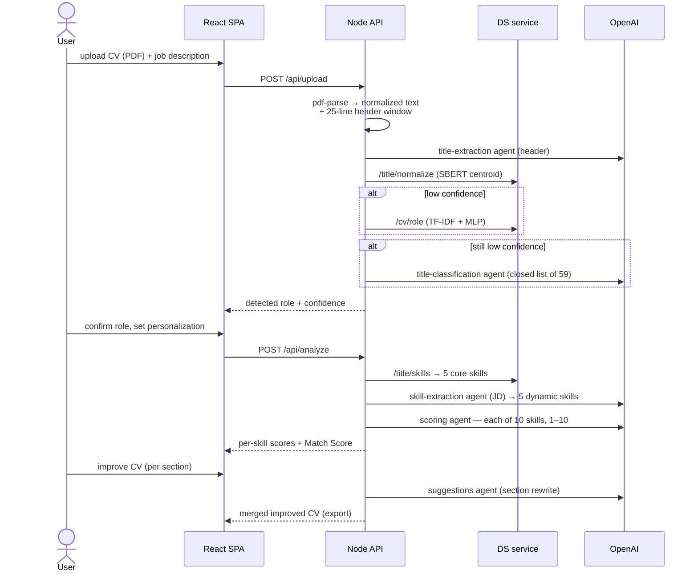

# CareerLens — System Architecture

> Canonical architecture description, verified against the code (2026-07-21).
> The three Mermaid diagrams below are the source for the rendered figures in
> `docs/progect_book/figures/`. If the system changes, change this file first.

CareerLens analyzes a candidate's CV (PDF) against a job description and returns a
per-skill, evidence-based match assessment with an improvement path. The runtime is
three services on the request path — a React SPA, a Node/TypeScript API, and a Python
FastAPI DS service — backed by MongoDB and the OpenAI API. A nightly pipeline retrains
the market model behind a promotion gate.

## 1. As-built architecture (Figure 2)

Key facts the diagram encodes:

- The browser talks **only** to the Node API. The DS service is internal.
- **Five LLM agents** live inside the Node API (scoring, skill extraction, suggestions,
  title classification, title extraction), all calling OpenAI (`gpt-4o-mini`, fallback
  `gpt-4.1-mini`) behind JSON-validation guards.
- The DS service serves **from model artifacts loaded at startup** (`model.joblib`,
  `text_to_job_title_classifier.joblib`, `title_normalizer.joblib`) — it does not
  query MongoDB on the request path.
- The `jobs` database is written by the scraping/training pipeline; the backend holds
  a **read-only** connection used only by the admin model-status view.

*Deployment view:* five long-running containers (`mongodb`, `backend`, `ds`,
`frontend`, `ofelia`) plus a `scraper` service and a batch `pipeline` container
triggered nightly by the `ofelia` cron.

## 2. Data & training pipeline with promotion gate (Figure 3)

The pipeline's defining idea: a freshly trained model **never replaces production
automatically**. The promotion gate compares it against the currently served model
and rejects regressions; rejected runs are logged to `model_runs` and production
keeps serving the old model.

**What the gate actually checks** (`promotion_gate.py`): total record count, how
many canonical titles carry any data, and how many clear a density threshold of 50
records. All three are **coverage** measures — the gate refuses a run that shrinks
the corpus, but it has no notion of accuracy and cannot distinguish a better model
from a worse one. That limitation is measured and stated in
`docs/final-sprint/outputs/official-metrics.md` §3.

## 3. End-to-end request flow (Figure 4)

One user journey, upload to improved CV. Role detection is a **three-rung ladder**
whose failure modes are disjoint: a title stated in the CV header is extracted by an
LLM agent and matched semantically; failing that, the classifier reads the CV body;
failing that, an LLM chooses from the closed list of 59 roles (answers off the list
are rejected by a validation guard).

## Rendered figures (for the project book)

The book uses a **simplified per-step figure set** (user readability directive,
2026-07-21): each diagram carries its own title, covers one step, 4-6 boxes. Sources:
`docs/final-sprint/outputs/diagrams/src/`; rendered PNGs: `docs/progect_book/figures/`.
The detailed Mermaid diagrams above remain the full technical reference.

- **Figure 1** — as designed (spec `image2.png`)
- **Figure 2** — System overview (who talks to whom)
- **Figure 3** — Nightly learning + coverage gate (the gate counts records and
  title coverage; it does not measure model accuracy — see `outputs/official-metrics.md`)
- **Figures 4-7** — the four user-journey steps: Upload & Role Detection /
  Personalize / Analyze / Improve
