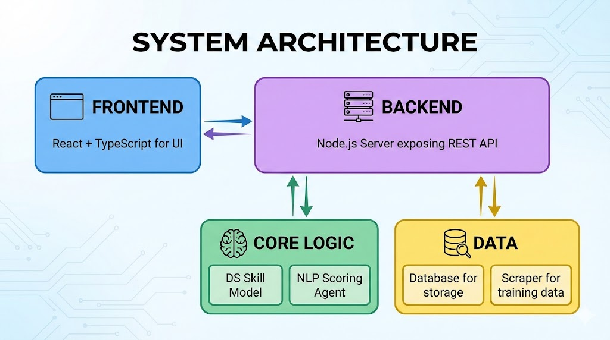
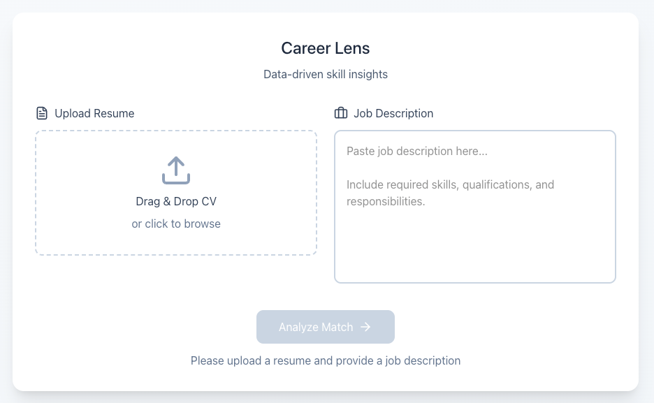
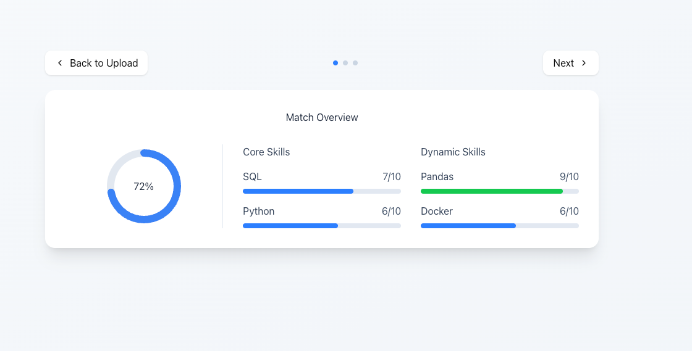
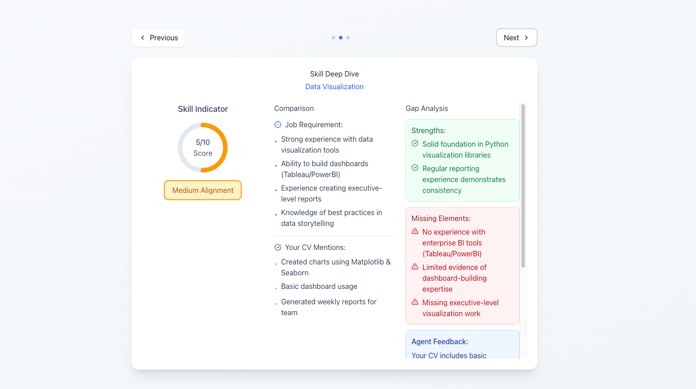
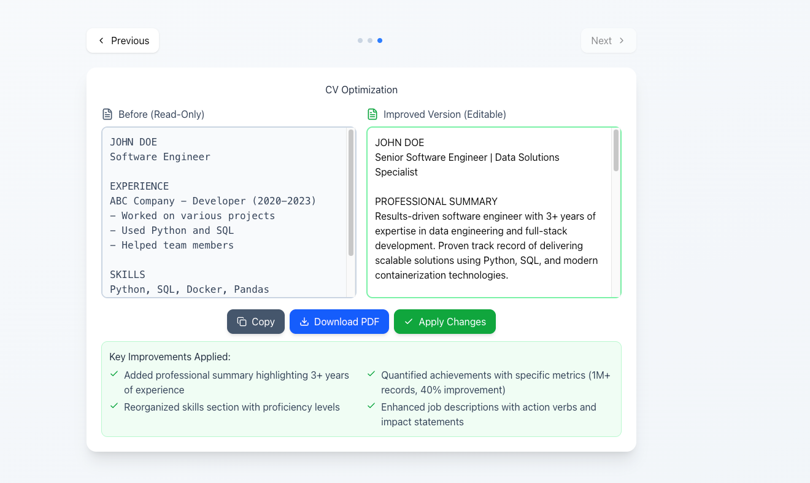

# Career Lens: Final Project Definition

**By:**
- Amit Alon (ID: 212052419) - 050-8577446 - amit01droid@gmail.com
- May Eliyahu (ID: 21217057) - 050-2232821 - may2001may.e@gmail.com
- Yarin Golzar (ID: 214440919) - 054-2158668 - yaringolzar@gmail.com
- Reut Maduel (ID: 214342693) - 052-3135348 - reutmaduel114@gmail.com

Supervisor: Dr. Galit Haim

**Git Repository:** https://github.com/yaringol/CareerLens

## Table of Contents

- Project Description
- Related Work
- Functional Description / Requirements
- Architecture
- Work Plan
- Client Side
- Server Side (API)
- References

## 1. Project Description

Career Lens is a Data Science project designed to significantly ease the resume submission process for job seekers and prevent unnecessary rejections during the initial screening phase.

### The Problem

Many candidates are unaware that their CVs do not sufficiently highlight the specific skills employers are looking for. Consequently, they may be rejected by Applicant Tracking Systems (ATS) or human recruiters due to phrasing, formatting, or lack of emphasis, even if they possess the required qualifications.

### The Solution

Career Lens allows a candidate to input their CV and a specific job description. The system utilizes NLP and LLM agents to:

- Parse and analyze the CV (English only) against the job requirements.
- Identify missing or under-emphasized skills.
- Provide a specific "Match Score."
- Generate an improved version of the CV optimized to pass automatic screenings (ATS) and human review.

## 2. Related Work

Currently, three main types of solutions exist in the market. Career Lens aims to bridge the gap between them.

**1. Recruiter ATS Systems**

- Description: Systems that filter CVs based on strict keywords.
- Pros: Fast filtering of massive candidate volumes.
- Cons: Strict rejection of suitable candidates due to different phrasing or lack of keyword emphasis.

**2. Employer AI Tools**

- Description: Advanced NLP systems used by HR departments to analyze match suitability.
- Pros: Fast and efficient understanding of candidate fit.
- Cons: These tools are closed to the public; candidates have no access to them and remain unaware of why they were rejected.

**3. Basic Candidate Tools**

- Description: Systems offering generic CV upgrades or keyword stuffing.
- Pros: Convenient and fast.
- Cons: Lacks deep analysis. They do not provide specific ranking of skill importance and rely on "dry" parameters rather than a deep semantic understanding of the specific job description.

## 3. Functional Description / Requirements

This section describes the system's core capabilities. The system operates on a dual-input model (CV + Job Description) to produce actionable insights.

### Functional Requirements

**1. Input Handling**

- PDF Parser: The system utilizes libraries (e.g., PyMuPDF) to reliably extract text from PDF resumes, handling tokenization and stopword removal.
- Job Input: Users can paste job description text or provide a URL for scraping.
- Language Support: The system supports English-language CVs and job descriptions only. All text processing, skill extraction, scoring, and model training are performed on English data.

Note: Support for image-based job description input may be added in future versions of the system.

**2. Skill Extraction & Classification**

- Auto-generation: The system identifies the top 10 relevant skills for the specific job, categorized into:
  - 5 Core Skills: Technical/Hard requirements.
  - 5 Dynamic Skills: Soft/Adaptive requirements.

**3. Scoring & Analysis**

- NLP Scoring: The Agent analyzes the CV and assigns a score (1–10) to each of the 10 identified skills based on prominence and context.
- Match Calculation: The system calculates a weighted average "Global Match Score."
- Gap Analysis: A comparison table showing the gap between the requirement and the current CV status.

**4. Optimization**

- Suggestions: The system provides specific phrasing suggestions to close identified gaps.
- Export: The user can download the improved content or copy the optimized text to their clipboard.

## 4. Architecture

The system is built on a Client-Server architecture with a dedicated Data Science pipeline.

### 4.1. Module Descriptions

**Client Side (Frontend)**

- Built with React and TypeScript.
- Responsible for the UI, file uploading, dashboard visualization (scores/graphs), and displaying optimization suggestions.
- Manages application state and basic input validation before requests are sent to the backend.

**Server Side (Backend)**

- Built with Node.js and TypeScript.
- Acts as the API Gateway. It manages user sessions, handles file uploads, and routes requests to the Python AI service.
- Integration Layer: Manages communication with external services (Gemini/OpenAI), handling retries and throttling.

**PDF Parser Module**

- Responsible for converting the visual PDF into structured, raw text sequences ready for NLP processing.

**Job Preprocessor, Scraper & Dataset**

- Data Collection: To build the training/validation dataset, the system utilizes Selenium to scrape job data from sites (e.g., AllJobs, Glassdoor).
- Processing: Extracts job title, requirements, and descriptions, saving results in JSON format. This data is used to "teach" the model to identify the 5 Core/5 Dynamic skills.

**DS Model & NLP Agent**

- Skill Extractor: Analyzes the job description to output the target skills.
- Scoring Agent: An LLM-based agent (using OpenAI or Gemini API) that receives "Clean CV" and "Target Skills" and outputs a JSON containing scores (1-10) and semantic feedback.

Note: The NLP pipeline and LLM prompts are designed and optimized for English text only.

**Database**

- Structure: MongoDB (or JSON/CSV for prototype).
- Role: Stores user sessions, uploaded CV metadata, analysis history, and scraped job datasets.

## 5. Work Plan

The following table outlines the major milestones, research tasks, and implementation phases of the CareerLens project.

| Milestone | Description | Responsibility | Estimated Due Date |
|---|---|---|---|
| Market & Tool Research | Research existing ATS systems, recruiter tools, and candidate-facing tools. Identify gaps and limitations. | Amit | Week 1 |
| Data Storage Research | Research and evaluate suitable databases for storing CV text, metadata, and extracted skills (MongoDB vs PostgreSQL). | Yarin | Week 1 |
| Document Storage Research | Research storage solutions for raw CV files (PDF) and OCR text sources (local FS vs cloud storage). | Yarin | Week 1 |
| Job Data Collection | Scrape 500+ real job descriptions from public job boards (e.g., Glassdoor, AllJobs). | May | Week 2 |
| Dataset Cleaning & Labeling | Clean scraped job data, normalize text, and manually/semi-automatically label skills. | Reut | Week 2–3 |
| PDF Parsing Pipeline | Implement PDF text extraction using PyMuPDF / PDFMiner. | May | Week 3 |
| Text Preprocessing Module | Implement tokenization, normalization, stopword removal, and sentence splitting. | Yarin | Week 3 |
| Skill Extraction Model (DS) | Develop rule-based + statistical approach for extracting top skills from job descriptions. | Amit+May | Week 4 |
| Skill Clustering | Group extracted skills into Core (technical) and Dynamic (soft/adaptive) categories. | Yarin+Reut | Week 4 |
| LLM Prompt Design | Design and test prompt-based LLM templates for skill presence and depth evaluation. | May | Week 4 |
| Skill Scoring Agent (NLP) | Implement prompt-based LLM scoring mechanism that assigns a 1–10 score per skill. | May | Week 5 |
| Match Score Calculation | Define and implement global match score aggregation logic. | Amit | Week 5 |
| Gap Analysis Logic | Develop logic for identifying missing or weak skills relative to job requirements. | Reut | Week 5 |
| Model Training & Calibration | Train and calibrate the skill extraction and scoring models using the collected dataset. Includes prompt tuning and score normalization. | Amit | Week 6 |
| Model Evaluation | Evaluate model performance on unseen CV–job pairs and refine based on results. | Reut | Week 6 |
| Backend Implementation | Implement Node.js backend and API endpoints. | Yarin | Week 6 |
| Frontend UI Design | Create Figma mockups for all major screens (input, dashboard, deep dive, optimization). | Amit | Week 6 |
| Frontend Implementation | Implement React-based UI and dashboard components. | May | Week 7 |
| System Integration | Connect frontend, backend, and Python NLP agent. | Reut | Week 7 |
| End-to-End Testing | Test full system flow with real CVs and job descriptions. | Amit | Week 8 |
| Evaluation & Results Analysis | Analyze model performance, scoring consistency, and system limitations. | Yarin | Week 8 |
| Final Documentation | Prepare final report, architecture diagrams, and technical documentation. | Yarin | Week 9 |
| Presentation Preparation | Prepare slides, demo flow, and verbal explanations. | Reut | Week 9 |

## 6. Client Side

This section describes the user interface and flow.

### 6.1. Usage Illustration

- Data Ingestion: The user uploads their CV (PDF) and pastes a Job Description.
- Processing: The system parses the PDF and extracts the top 10 skills from the Job Description.
- Analysis: The DS Model compares the two texts.
- Result: The user sees a Dashboard with a "Match Score" (e.g., 72%) and a breakdown of which skills are missing.
- Optimization: The user clicks "Optimize" to see how to rephrase their CV to increase the score.

### 6.2. Screen Mockups

**Input Screen**

**Match Overview Screen**

**Results Visualization Screen**

**CV Optimization Screen**

## 7. Server Side (API)

The server exposes RESTful APIs consumed by the frontend and acts as the single entry point for all client requests.

### 7.1. API Definition

| Method | Endpoint | Description |
|---|---|---|
| POST | /cv/upload | Upload & parse PDF CV file. |
| POST | /jobs/extract | Extract skills from pasted job text or URL. |
| POST | /analysis/score | Score the uploaded CV against the extracted skills. |
| GET | /analysis/results/:id | Fetch the match breakdown (Core vs. Dynamic scores). |
| GET | /cv/optimized | Get the improved version of the CV text. |
| GET | /history | Retrieve past user sessions. |

## 8. References

- PyMuPDF Documentation: For PDF extraction methods.
- Selenium: For web scraping architecture and data collection.
- OpenAI/Gemini API: For LLM integration and Prompt Engineering.
- React & Node.js: Official documentation for full-stack implementation.
