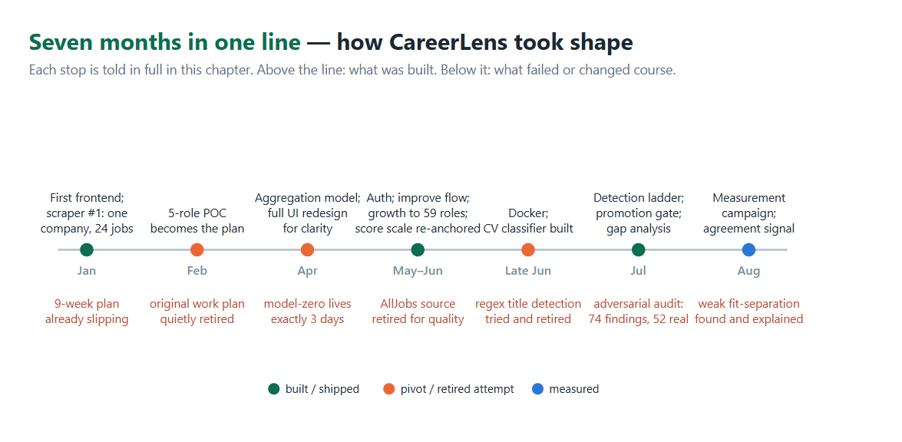

# 3. Research

This chapter is the story of how CareerLens's two models took their final shape:
what we tried, what failed, why it failed, and what we did next. Each section
opens with the solution that actually ships — the destination — and then walks
the road that led to it, because several of the mechanisms that define the final
system (the label-scrubbing step, the three-rung role-detection ladder, the
promotion gate) exist only because an earlier, simpler idea broke first and
taught us something we did not know. Figure 1 puts the whole journey on one
line; everything on it is told in full below.

*Figure 1 — Seven months in one line: above the line, what was built; below it, what failed or changed course.*

## 3.1 Model 1: from skill counting to a market model

The market model that ships today is a nightly-retrained statistical aggregation
over 59 roles: prevalence-ranked, stability-selected, ubiquity-filtered skill
lists, guarded by a promotion gate, and — under blind annotation — 97% relevant.
Almost none of that was designed up front. It was arrived at, one failure at a
time, and this section walks that road.

It begins with a re-scope. One day after the original nine-week plan's second
milestone passed its deadline, a new milestone appeared on the project board: a
mandatory proof of concept, exactly five predefined roles and five core skills.
The nine-week plan was never formally closed; the POC simply replaced it. In
hindsight this was the right call. Everything that follows grew out of a small
working system that could be touched and judged, not out of a full specified
scope being built in parallel.

Our first model lasted exactly three days. It indexed 8,486 raw scraped job
titles with TF-IDF, found a query's ten nearest neighbours, and returned the most
frequent skills among them — with the entire dataset serialized into a 4.77MB
artifact. We never measured it; a manual spot check was enough to end it. Asked
about `python developer`, it returned *python, backend, scalable, computer
science, best practices* — three of the five generic noise. Three days later it
was gone. Its replacement's artifact weighed 139KB — thirty-four times smaller
and better at the same time, because the original had been carrying the whole
dataset as its "model" — and its training notebook shed over nine and a half
thousand of its ten thousand lines. What survives of model-zero is a fossil: the
replacement's noise blacklist still contains, verbatim, the three bad outputs of
that one spot check — the moment a failed check became an architecture decision.

What replaced it was barely a model at all, and that was the point. For each of a
handful of hand-curated POC roles, we summed the weighted skill matches that
SkillNer extracted from scraped postings and served the top of the list. It was
simple enough to demonstrate the product idea, and simple enough that retraining
was a cheap nightly aggregation rather than a training run. When the system later
grew to 59 canonical roles, the aggregation grew with it into a feature matrix:
for every (role, skill) pair we compute *prevalence* (how often postings for the
role ask for the skill, recency-weighted), *title specificity* (an IDF-style
measure of how exclusive the skill is to the role [6]), and time-based features
over the accumulating history.

Feeding this model was a search of its own, and it too moved by failure. The
first scraper we ever wrote targeted a single company's careers page, because it
was reachable and unblocked; it yielded twenty-four postings. AllJobs came next,
wrapped in a Hebrew-to-English translation pipeline, and was retired wholesale
once we saw what it produced: low-quality, outdated postings with translation
artifacts on top. Glassdoor, named in the specification, was never attempted. So
we went back to the source we had been avoiding for fear of blocking, LinkedIn,
and put in the engineering effort to collect from it reliably. It paid off; the
data quality justified every workaround. The last piece was the external lang-uk
corpus (2020-2023), and its job is more interesting than "more data": it is a
time machine. A five-month project cannot scrape the multi-year history that
trend and stability features need, so a verified historical corpus stands in for
the system's mature future, and the stable-versus-trending personalization
signals can be demonstrated today over a horizon our own scraping will only
reach years from now. From twenty-four postings to a corpus of over 180,000
postings and profiles, the arc taught us one thing above all: data quality, not
access convenience, sets a market model's ceiling.

Then, while mapping the project's architecture — establishing what actually
connects to what — we found something uncomfortable: the nightly scrape-and-train
loop was not feeding the served model at all. The scraper wrote to a local file,
and the trainer read from a collection that nothing populated. The pipeline had
every appearance of health, and it had never done anything. Charting that wiring
and fixing it produced what we now consider one of the project's better ideas: a
**promotion gate** between training and serving. A freshly trained model is
compared against the model currently in production on total record mass, role
coverage, and per-role confidence, and it is promoted only if it does not regress.
The gate proved itself almost immediately, in three consecutive real runs. The
first, trained on a partial scrape, was rejected: a fraction of the expected
records, one role covered. The second, broader but still narrow, was rejected
again, four roles with data where the gate demanded eight. The third, a LinkedIn
scrape merged with the external corpus at reduced weight, passed and became the
serving model. Without the gate, either of the first two runs would have quietly
replaced a working model with a broken one during the night.

The model's hardest lesson surfaced embarrassingly late, during a pre-submission
audit — and it turned out to be a *family* of failures, all with the same shape:
a feature that existed in the code and was dead in practice. The serving path, it
emerged, ranked skills by prevalence alone: the specificity feature was computed,
stored in the artifact, and described in the README's ranking formula, but the
code answering live requests never read it. The symptom was memorable — the
top-ranked skill for a Frontend Developer was "backend", because generic
engineering terms are prevalent everywhere, and only the unread specificity term
knew they were not distinctive. The same audit found the trend feature
mathematically dead: its rising/falling thresholds (1.25 and 0.80) sat entirely
outside the range the data could actually produce, so of 60,334 skills, exactly
zero had ever been labeled rising or falling — a feature that could not fire.
And a one-character-class bug in a key name (`time_coverage_reliable` read where
`time_features_reliable` was stored) had every reliability flag in the product
reading false. Each repair was chosen for safety days before code freeze: the
trend thresholds were recalibrated to percentiles at server load, leaving the
artifact untouched; the key was fixed in one line; and rather than wiring
specificity into serving — a change with unpredictable effects across all 59
roles — we attacked the ranking symptom directly with a ubiquity filter that
excludes skills appearing under nearly every role, retrained on the merged
corpus, and added a floor so that a role with only a handful of records now
answers `limited_data` instead of serving fabricated fragments. Then we measured
what changed (Chapter 5): the retrained model's top-10 lists are 97% relevant,
and the cross-role contamination that started this story — `backend` under
Frontend Developer, `python` under Java Developer — no longer appears in them.
The specificity feature remains computed and unread to this day, and Section 4.3
says so. What we carried forward: a feature that is computed but never consumed
is not a feature, and only inspecting what the serving code actually returns,
rather than the training code or the documentation, tells you what your model
does.

## 3.2 Model 2: proving that it learns

The classifier that ships today reads a scrubbed CV body and predicts over the
59 canonical roles plus an explicit reject class, and every number we publish
for it was measured after its training data was cleaned of the shortcut that
inflated its first results. Getting to "numbers we can defend" is this section's
story.

The CV→title classifier began with a suspiciously excellent number: a
near-perfect macro-F1 on held-out data, measured on an early 38-class prototype.
Numbers that good demand suspicion, so we went looking, and the training corpus
delivered the explanation. 77% of the CVs contained their labeled job title
verbatim in the summary section. The model was not reading careers; it was
copying the answer from the top of the page, a textbook shortcut in the sense of
Geirhos et al. [14]. The fix was a scrubbing step: at training time, the CV's own
title string is removed from its body, and the current position's heading is
dropped from the experience block. Scrubbed, the score fell visibly — a worse
number and a far better model, and the only kind of number we were willing to
keep [15]. We cite no figures from that prototype in this book: it is not the
deployed model, and its within-corpus scores describe a system that no longer
exists. The deployed classifier's numbers, component and system alike, appear in
Chapter 5.

The obvious next idea failed completely, and the failure drew a boundary we had
not known existed. If title words leak labels, why not add them all as
stop-words? Because in this domain label words *are* content words. "React",
"sql", and "java" are title fragments and legitimate skills at the same time,
and removing them cratered framework-centric classes to an F1 around 0.2. So
leakage had to be removed surgically, per document — this CV's own label — and
never globally, per vocabulary.

The label space went through three shapes of its own. The raw corpus carried 65
title strings, synonym-fragmented ("React Developer" vs. "Frontend Developer")
with a long tail of classes too rare to learn. We consolidated to 38 clean
classes, then mapped them through a hand-curated table into the 59 canonical
roles that model 1 understands. That bridge held until the project's final
phase, when the audit retired it: the deployed classifier is now trained
directly on the 59 canonical roles plus an explicit `__other__` reject class,
removing a whole layer of semantic drift between what the classifier says and
what the skills model can answer. The specialist third of the taxonomy posed a
harder choice. For 33 roles we could find no real CVs anywhere. We weighed
shrinking the taxonomy and hand-labeling, and chose a third path: synthetic
title strings as a bridge, so all 59 roles stay usable while we keep looking for
a real corpus. The cost of that bridge only became visible in measurement, not
in design review — a no-data role can be guessed wrong at high confidence, with
no safety net underneath. Chapter 5 measures exactly that, and shows how the
detection ladder's declared-title rung turned out to absorb it.

On architecture, the comparison that mattered was a linear baseline against a
shallow network on identical scrubbed features: logistic regression reached
57.6% accuracy, a one-layer MLP 62.3%. We kept the MLP and we present it as what
it is, a modest, validated increment over a strong linear baseline [7], measured
only after the leakage was gone, because comparisons made on leaky data are not
comparisons [15]. Both figures describe the classifier component in isolation.
The accuracy the user actually experiences belongs to the whole detection ladder
and is markedly higher; Chapter 5 measures both and explains the gap. How that
ladder came to exist is the next story.

## 3.3 Role detection as a system, not a model

What ships today for role detection is not a model but a system: a three-rung
ladder — read the declared title and normalize it semantically; failing that,
classify the CV body; failing that, ask a language model constrained to the
closed list — plus a second-opinion agreement signal that can veto a confident
answer. Every rung of that design is a scar from an attempt that failed, and the
scars are worth reading in order.

The first attempt was regex-based extraction of the stated title — a real
contender, not a placeholder — and its failure delivered the domain's defining
lesson: a CV is not structured, everyone writes their own. Next came the
matching problem, connecting whatever title we did find to our canonical list.
The cheap answer was a character-n-gram nearest-neighbour matcher,
dependency-free and semantically blind, and it became our most quotable failure.
It mapped "iOS Developer" to *Kernel Developer* (both contain "os"),
"JavaScript Developer" to *Java Developer*, and "SQL Developer" to *Frontend
Developer*. Spelling similarity, we learned, is not semantic similarity; for job
titles the two are frequently opposites. Its replacement was chosen by
measurement, not taste: the sentence-embedding normalizer that ships today
scored 92.6% on the same held-out split where the character matcher managed
69.4% — a twenty-three point jump that ended the argument.

Even the "solved" rung kept teaching. Late in the project we discovered that the
declared-title rung — the ladder's first and best step — had been *dead code for
every real PDF upload*: the text normalization that every other consumer
depended on stripped the line breaks, the header extractor skipped the resulting
CV-length "line", and every upload silently fell through to the classifier. We
found it not through a bug report but while recording demo videos, when a
textbook-clean CV refused to take the path it obviously should. The fix — a
preserved header window travelling alongside the flattened text (the asymmetry
Section 4.2 documents) — promptly opened two subtler holes, each caught and
closed in turn. First, splitting header lines on commas shredded summary
sentences into fragments, and a bare buzzword like "Kubernetes" could outscore
the real title against the canonical list and win a silent, confident,
wrong auto-accept. Then the repair for *that* — folding PDF line-wrap fragments
back into their sentences — initially folded email addresses onto genuine title
lines and destroyed them: twenty of twenty regression cases failed at once. The
regression suite caught it within the hour, and the final fix folds only lines
that are not independently recognizable as noise. The episode hardened a rule we
kept for the rest of the project: PDF text is an adversary, and no header
heuristic changes without the full suite running behind it.

The regex failure had also planted an idea that took months to mature. If the
title line cannot be trusted, but the skills we extract from a CV can, then the
role should be inferable from the skills themselves — a bidirectional role-skill
inference, title→skills and skills→title (the latter direction is known in the
literature as occupation prediction from skill profiles, within the job-title
classification family surveyed in [13]). We shelved the idea for lack of time
and built the pragmatic ladder instead: sentence embeddings [8] against per-role
centroids [9] over the 59 canonical roles for a stated title; the TF-IDF+MLP
classifier when no usable title exists; and a language-model agent choosing from
the *closed list* of 59 roles when confidence is too low, with a validation
guard that rejects any answer not literally on the list, because a fallback that
can invent roles is worse than no fallback. Detection, we concluded, is a system
property: no single mechanism survives contact with real CVs, but the ladder's
failure modes are disjoint. (Model experiments conducted outside this repository
are recorded separately in the project chronicle and are not claimed here.)

The closing weeks gave the shelved idea its turn, and gave us two last lessons
in discipline. The first came from our own rules: the production normalizer had
grown undocumented, so we reconstructed it in a notebook and compared the
rebuild against the live artifact — an exact aggregate tie, eight fixes against
eight regressions. Our equivalence gate therefore refused the swap, and we
obeyed it: the live artifact stayed, and the notebook became its specification.
The gates we build to stop bad models, it turns out, also stop us. The second
came from the reverse-direction notebook itself: a classifier predicting the
role from a CV's extracted skill set alone, trained over the well-covered
titles. Head-to-head on our authentic-CV corpus it tied the deployed text
classifier. Not an upgrade, and we did not ship it as one. But the experiment
surfaced something subtler and more useful: when the two directions *agreed* on
a CV, the answer was far more likely to be correct than either model's own
confidence score could indicate. A model's self-reported confidence is one
witness testifying about itself; two independently trained witnesses agreeing is
evidence of a different kind. That observation became the production **agreement
signal** of Section 4.3: boost on agreement, cap on disagreement, skip when the
check cannot change the outcome. Wiring it in produced one last, humbling
lesson. The signal was first attached to the DS endpoint that the design
documents said the product called — and tracing the real request path showed the
backend never called that endpoint at all. We re-wired the signal onto the rung
the product actually executes, and only then could its effect be measured
end-to-end (Chapter 5). Even in the project's final week, the gap between the
documented path and the executed path was still teaching us to verify the
wiring, not the wiring diagram.

## 3.4 Experiments that shaped the product, not the models

Not every experiment in this project happened inside a model. Some of the most
consequential trial-and-error happened in what the product says to its user, and
those episodes deserve the same telling.

Take the skill scale. It was recalibrated twice, and neither change came from a
metric. The first came from a direct note by our supervisor: something truly bad
must start from zero — a candidate who does not know Linux cannot receive a 1
for it. We re-anchored the scale at 0. The second change came from thinking
about recruiters rather than models: real screening effectively demands a high
fit before a human engages, so we tightened the "strong" band to 8.0–10, because
the product should tell a candidate their CV is strong only when that is
actually true. A score scale, we came to understand, is a product statement, not
a statistic; both anchors encode a promise to the user.

Another change taught us about our own mistakes. When automatic role detection
replaced the manual role dropdown, the manual override was removed along with
it, which left an out-of-domain CV — a nurse's, say — with nothing but nonsense
suggestions and no way to say "my role is not on your list." There was no design
rationale behind this. It was a misunderstanding of the task, and we would
rather say that than invent a justification after the fact. The escape hatch was
restored in the final phase: an unsupported CV now routes to "choose the closest
supported role" with a manual picker, and we verified the behavior live in the
shipped UI.

One feature managed to vanish without anyone deciding to remove it. An early
skill-preferences API (user-weighted skill ranking) was implemented, then
silently disappeared in a later rewrite of the serving code; no one recalls
choosing to drop it, and only its remnants stayed behind in the repository.
Months later the same idea resurfaced, properly productized this time, as the
Personalization screen with its stable, balanced, trending, and custom
strategies. Ideas outlive their first implementations — provided someone
eventually notices they were good.

The screens had their own hardest case. The Personalize screen absorbed more
consecutive fixes in one 48-hour stretch than any other part of the frontend,
and the post-mortem was unambiguous: we had built the screen before defining its
data contract. Where the skill pool comes from, how it grows from five skills to
ten without overlaps, how the user's selections travel to the next screen — all
of it was resolved while the screen already existed, one fix at a time. The
lesson pairs with the per-section versioning story of Section 4.3: design the
data contract before the UI that renders it. (The frontend as a whole went
through one deliberate full redesign, from the functional screens of January to
the product that ships — driven not by a failure but by a value the team held:
the application should be clear, pleasant, and readable, with an obvious flow.)

And finally, testing. The hand-written acceptance set that drove our hard-case
debugging was built by enumerating the system's possible user flows — clear
title, no title, out-of-domain, ambiguous, and so on — so that every case
represents a path a real user could take. That discipline is what gave a small
hand-written set its outsized diagnostic power, and it later shaped the scenario
taxonomy of the formal evaluation corpus (Section 5.1).

## 3.5 What the pipeline taught us about believing automation

We end the chapter where its hardest lesson lives, back at the pipeline of
§3.1, because that lesson generalizes beyond this project. The pipeline had
every appearance of health: a scheduler that fired nightly, a scraper that
logged success, a trainer that produced artifacts. What it lacked was a single
end-to-end assertion — *did the serving model actually change, and is it
better?*

The same lesson kept returning in new costumes. One July morning the product
was serving a model whose skill arrays were empty for all 269 stored roles — a
mid-training intermediate artifact had ended up on disk — and every analysis
request in the product failed until the next day's retrain. Nothing had
crashed; the model was simply hollow, and nothing between training and serving
had checked. Our own first test suite turned out to embody the opposite
failure: it retried each CV up to three times until the score landed inside a
band the team itself had defined — a test that, in effect, graded its own
homework. When the audit caught the circularity we demoted the suite from
evidence to smoke test, and built the labeled corpus of Chapter 5 in its place.

Every piece of automation we built after these discoveries carries an
end-to-end assertion in some form: the promotion gate for training runs,
JSON-schema validation guards on every LLM agent's output, and an evaluation
corpus with pinned ground truth (Section 4.4) in place of ad-hoc spot checks.
(Resolving the pipeline also closed the deployment story: migrating the whole
system onto Docker in late June surfaced structural issues that took real
fixing, and the containerized pipeline-plus-gate of Section 4.1 is the result.)
"It runs every night" and "it works" are different claims, and only the second
one is worth reporting. The next chapter describes the system that survived all
of the above.
