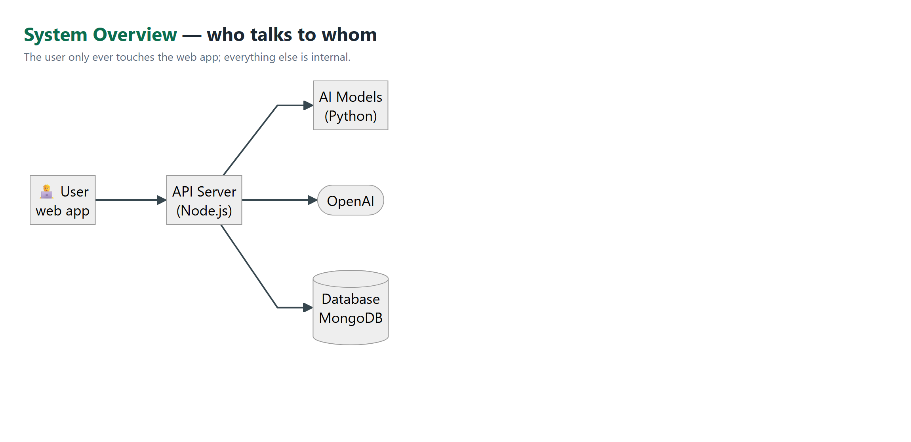
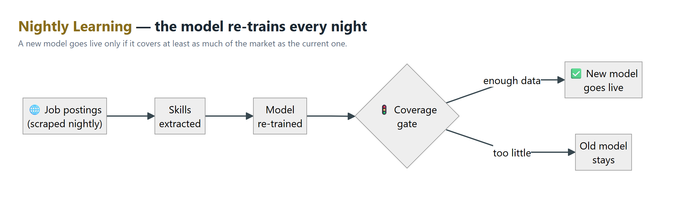
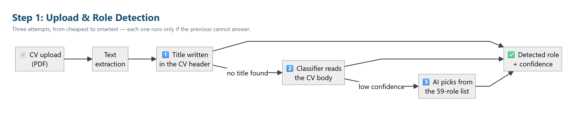
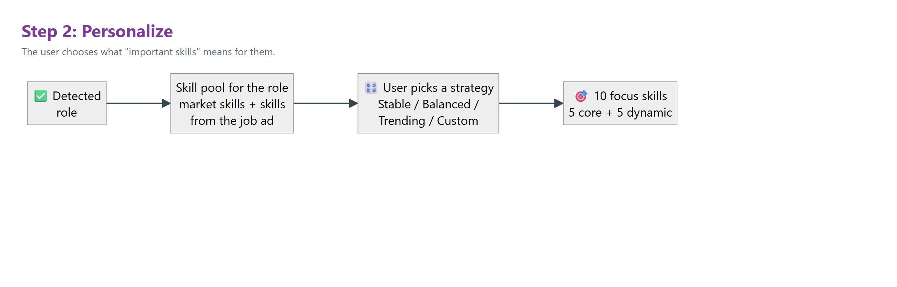
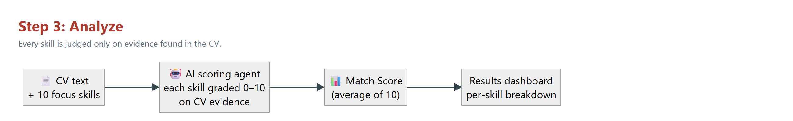
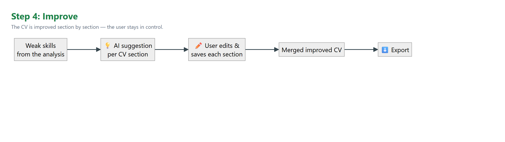
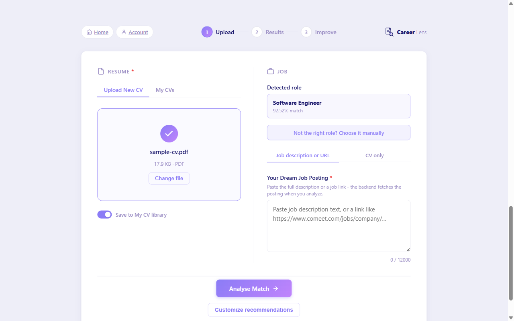
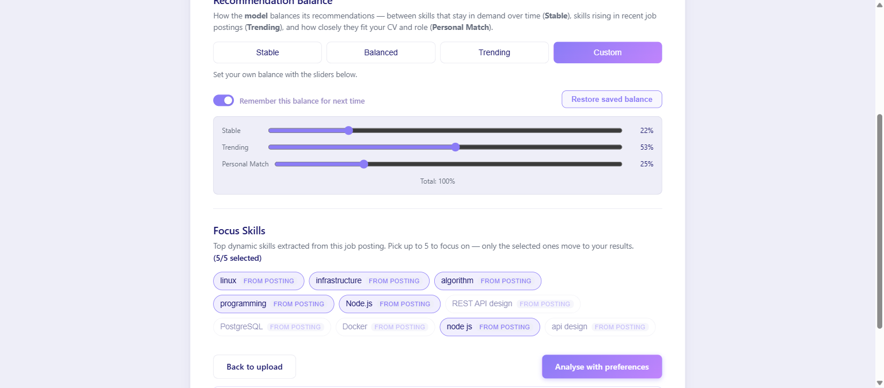
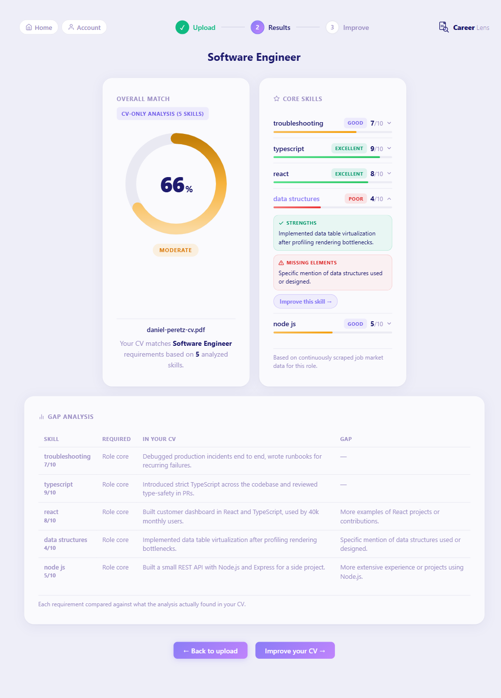
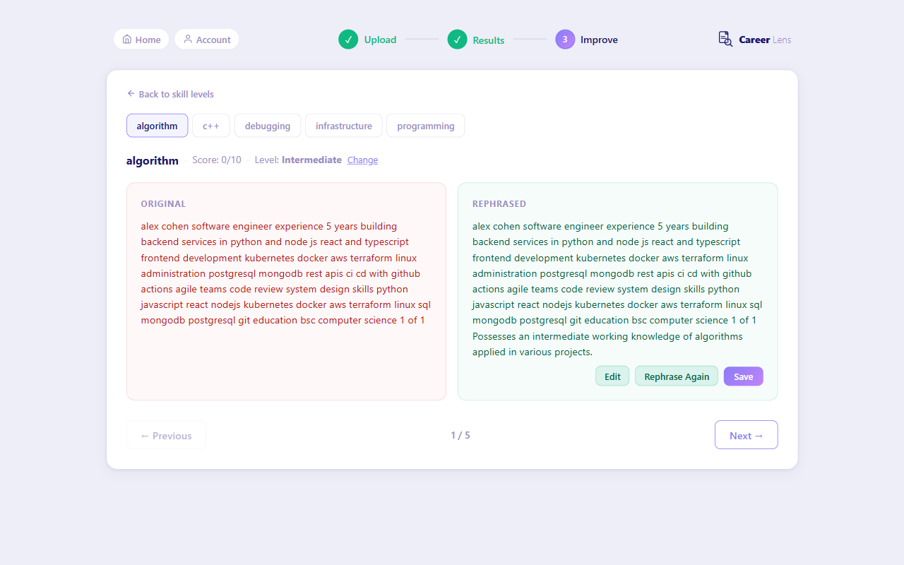

# 4. System Design and Implementation

Chapter 3 told the story of how the pieces came to be; this chapter describes the system they add up to, as actually built and shipped, verified against the code rather than against our earlier design documents. Where the implementation diverges from the original plan, we say so here and analyze the divergence in Section 5.6.

## 4.1 System Architecture

CareerLens is composed of three cooperating services on the request path. A React single-page application (SPA) is the only surface the user touches. It talks exclusively to a Node.js/TypeScript API server, which owns authentication (JWT), request validation, orchestration, and all five LLM agents. The Node API in turn is the only client of a Python FastAPI data-science (DS) server, which hosts the learned models: the title-to-skills market model (model 1), the CV-body-to-title neural classifier (model 2), the sentence-embedding title normalizer, and the SkillNer skill extractor. Persistence is MongoDB with two logical databases: `careerlens` (users, saved CVs, analyses, improvement sessions) and `jobs` (scraped postings, extracted skill observations, training runs). 
*Figure 2 — System overview: the user touches only the web app; the API server orchestrates the AI models, OpenAI, and the database.*

Two boundary rules organize the design. First, the frontend never calls the DS service directly — the DS base URL exists only in the backend's environment — so every model invocation passes through one place that can validate inputs, apply thresholds, and fall back gracefully. Second, the `jobs` database is written only by the data-collection side (the scraper and the nightly pipeline); the backend opens a read-only connection to it solely for the admin model-status dashboard, never on the user request path.

In deployment (docker-compose) the system runs as five long-lived containers — MongoDB, backend, DS, scraper, frontend — plus two batch components: a `pipeline` container that runs the daily scrape–extract–retrain job, and an `ofelia` cron sidecar that launches it on schedule. The pipeline writes model artifacts to a `model_data` volume shared with the DS container; a container restart is the promotion mechanism, and the restart happens only when the training run passes the promotion gate (Section 4.3). The gate is a **coverage** check, not an accuracy check: it compares record counts, the number of titles carrying data, and how many of those clear a density threshold, refusing a run that shrinks the corpus. It cannot tell a more accurate model from a less accurate one. 
*Figure 3 — Nightly learning: a newly trained model goes live only if the coverage gate confirms it describes at least as much of the market as the current one.*

The Node API exposes the full product surface: authentication (`/register`, `/login`); CV management (`/upload`, a saved-CV library capped at ten files with up to three "starred" favorites); role detection (`/cv/title`, `/cv/extract-title`, `/title/match`); analysis (`/analyze`, `/analyze/personalized`, `/analyze/rescore`, `/analyze/compare-saved`); personalization (`/personalize/options`, saved preference endpoints); and the per-section improvement flow (`/cv-improve/prepare`, `/suggest`, `/merge`, plus session CRUD). A typical session flows upload → role detection → personalization → analysis → improvement. The user journey is four steps, each shown separately:


*Figure 4 — Step 1, Upload & Role Detection: three attempts from cheapest to smartest.*


*Figure 5 — Step 2, Personalize: the user chooses what "important skills" means.*


*Figure 6 — Step 3, Analyze: every skill graded 0–10 on CV evidence; the Match Score is their average.*


*Figure 7 — Step 4, Improve: section-by-section suggestions with the user in control.*

## 4.2 Data Collection and Preprocessing

The market model learns from two sources. The primary source is LinkedIn job postings collected by our scraper into a raw collection, then annotated at ingest by SkillNer — a phrase-matching extractor over the EMSI skill taxonomy (31,278 skills) running on spaCy — and persisted with their extracted skills. Extraction happens once, when a posting enters the corpus; training and serving never re-run the extractor over old postings, which keeps the nightly pipeline resumable and its cost bounded. The second source is the lang-uk recruitment datasets (Djinni, English): 210,250 candidate profiles and 141,897 job descriptions imported from Hugging Face and passed through the same SkillNer batch extractor, with a mapping layer that projects the Djinni role categories onto our canonical taxonomy. Because the two sources differ in quality and closeness to our taxonomy, training weights them per source (LinkedIn 1.0, lang-uk 0.3 by default). The historical corpus also plays a role beyond volume: its 2020-2023 span simulates what the system's own scraping will only accumulate after years of operation, which is what lets the stable-versus-trending signals of the personalization feature be demonstrated over a realistic time horizon today (Chapter 3 tells the reasoning). Because that span predates the LLM era's skills, training adds a curated 2024-2026 continuation — 10,800 records, every one explicitly marked `source='augmented-2026'` in the database, so synthetic data can never masquerade as observation.

Both sources converge into a unified `role_skill_observations` collection (schema version 2): one row per (posting, skill) observation, already carrying the resolved canonical title, the extractor's confidence score, and an `observed_at` timestamp. That timestamp is what makes every time-aware feature possible — recency weighting, trend labels, and the monthly-bucket stability slope all anchor to when a posting was actually published, not to when we happened to scrape it.

On the serving side, preprocessing begins at PDF upload. We extract the text layer with pdf-parse, then apply deliberately aggressive normalization — lowercase, punctuation stripped, all newlines flattened to spaces — because the downstream consumers (LLM scoring, keyword matching, skill extraction) were built around that canonical form. That same flattening, however, destroys the one signal title detection needs: real line breaks ("Alex Cohen\nSoftware Engineer" and "alex cohen software engineer" are not the same input). Rather than change the normalized text every other consumer depends on, the upload path additionally preserves a bounded window of the CV's original first 25 non-empty lines — case and punctuation intact — and both texts travel together through the API. This asymmetry is not elegant, but it is honest engineering: it fixes the title-detection input without risking regressions in four other consumers, and it bounds the raw text sent to the extraction LLM.

## 4.3 Implementation Details

**Model 1 — the market model.** This is the third incarnation of the idea — Chapter 3 tells how a nearest-neighbour prototype and an unguarded serving path each died on the way here. Training (`ds/model/train.py`) is a statistical aggregation, not gradient-based learning: each of the 59 canonical roles accumulates evidence from its postings, with each posting's contribution decayed exponentially by age (half-life 14 days) so that current demand dominates. For every (role, skill) pair we compute a small feature vector — the load-bearing lines, verbatim:

```python
prevalence  = total_score / denom          # recency-weighted mean
idf         = np.log(n_titles / skill_title_count[skill])
specificity = idf / np.log(max(n_titles, 2))
```

Prevalence answers "how often does this role ask for this skill now"; specificity is an IDF-style penalty on skills that appear under many roles. We state plainly what our own audit found (Chapter 3): the serving path never consumed the specificity feature — it is computed, stored in the artifact, and to this day not read at ranking time. What actually curbs everywhere-skills in production is a different, simpler mechanism added after the audit: a **ubiquity filter** that drops any skill appearing under more than a configurable number of roles (`SKILL_UBIQUITY_CAP`), together with a minimum-prevalence floor for a role to count as covered. With the filter in place, serving ranks the surviving skills by prevalence into a top-10 pool, then selects the displayed five by stability score, so the list favors what is both demanded and durable. A trend label (rising/stable/falling) compares the last seven days against all-time prevalence, and the stability score fits a slope over monthly occurrence buckets. Both filter parameters are environment-driven — an operational detail with measurement consequences, because a demo box running the defaults produces materially different rankings than the configuration we evaluate in Chapter 5.

Every nightly run then faces the promotion gate (`promotion_gate.py`). A new model replaces production only if it does not regress on data volume relative to the last promoted run:

```python
old_non_low = non_low_title_count(baseline_counts, canonical_titles)
new_non_low = non_low_title_count(new_counts, canonical_titles)
if new_non_low < old_non_low:
    return False, f'non_low titles dropped {old_non_low}->{new_non_low}'

old_total = total_records(baseline_counts, canonical_titles)
new_total = total_records(new_counts, canonical_titles)
if old_total > 0 and new_total < old_total * 0.8:
    return False, f'total records dropped >20% ({old_total}->{new_total})'
return True, 'ok'
```

The limitation is worth spelling out: this gate counts records, not accuracy. It reliably blocks the failure mode we actually observed — a run trained on a broken or partial scrape (Chapter 3 documents two real rejections) — but it would happily promote a well-fed model that ranks skills badly. Closing that gap with a quality metric (precision@10, Section 4.4) is future work we return to in Chapters 5 and 6.

**Model 2 and the role-detection ladder.** The CV-body classifier is a scikit-learn pipeline of a word-level TF-IDF vectorizer and an MLP classifier with one hidden layer of 256 units, predicting directly over the 59 canonical titles plus a `__other__` rejection class for non-engineering CVs. The served confidence is a deliberate transformation: the raw softmax mass is spread over 60 classes, so the server renormalizes the top-3 non-`__other__` candidates into shares — while letting `__other__`'s probability mass keep deflating those shares, because that deflation *is* the rejection signal that routes a request onward.

Role detection as a whole is a three-rung ladder in the backend, because no single mechanism survived contact with real CVs — regex, character matching, and a bare classifier each failed in its own instructive way (Chapter 3). First, an LLM agent extracts the candidate's self-declared title verbatim from the preserved header window, and the extracted phrase is normalized to the canonical space by a sentence-embedding nearest-centroid model (SBERT `all-MiniLM-L6-v2` over 59 centroids, accepted above 0.55 cosine similarity; 92.6% held-out accuracy, replacing a char-n-gram matcher). Second, if no self-declared title exists, the full-CV-body classifier takes over. Third, when every remaining candidate falls below a calibrated confidence threshold (55), a final LLM call classifies the CV against the closed 59-title list — with a hallucination guard that rejects any answer not verbatim in the list. Every result is tagged with its source (`title_extraction`, `classifier`, `llm_fallback`) so the UI and our evaluation can treat the confidence scales separately. The tag reaches the user too: when the answer comes from the constrained LLM, the UI shows an "AI matched" badge instead of a percentage — a closed-list pick is not a similarity score, and displaying it as one would lend it a precision it does not have.

The classifier rung carries one further, late-project safeguard: an **agreement signal** born from the reverse-direction experiment of Chapter 3. When the classifier proposes a title, the DS server can cross-examine that proposal against a second, independently trained model that predicts the title from the CV's *extracted skills* rather than its raw text. If the two models agree, the served confidence is boosted; if they disagree, it is capped below the auto-accept threshold, so the user sees the manual role picker instead of a confidently wrong answer. The check is skipped whenever it provably cannot change the routing decision, and the whole mechanism sits behind an environment flag (`AGREEMENT_SIGNAL_ENABLED`) so it can be ablated cleanly — which Chapter 5 does.

**The LLM agents.** Five agents run in the Node backend against `gpt-4o-mini` (temperature 0.2, `gpt-4.1-mini` as automatic fallback): skill-pool extraction from postings (exactly 5 core-priority + 5 additional skills), per-skill scoring, improvement suggestions, title extraction, and closed-list title classification. Each agent's contract is JSON with a validation guard behind it. The scoring agent's contract, from the system prompt:

```
Output discipline - return ONLY valid JSON, no markdown, no explanation:
{
  "skills": [
    { "skill": "<skill name>", "score": <integer 0-10> }
  ]
}
Include every supplied skill exactly once, in the order given,
using the skill names verbatim.
```

The backend never trusts this output blind. Parsed scores are re-aligned to the expected skill list by name; a missing skill is filled by a deterministic keyword-overlap score; a response where every skill gets the identical score — a real gpt-4o-mini failure mode we observed — is discarded wholesale in favor of keyword scoring; and if the LLM is unreachable, the same keyword fallback serves the request, flagged as estimated. The global Match Score is the unweighted mean of the ten per-skill scores (the original specification said "weighted average"; Section 5.6 examines that gap).

**Personalization.** The Recommendation Balance screen offers stable/balanced/trending/custom strategies. The user's stable and trending weights collapse to a single preference scalar (trending ÷ (stable + trending)), and the five core skills are chosen from the model's candidate pool by minimizing the distance between each skill's own stability score and that preference — prevalence breaks near-ties but is never blended in, so a highly demanded skill cannot override the user's stated preference. The five dynamic slots are filled independently from the posting-derived pool, honoring the user's explicit focus-skill selections first. Preferences persist per user.

**Per-section CV improvement.** The improvement flow deliberately avoids whole-CV LLM rewrites — a lesson bought, not assumed (Chapter 3's data-contract episode). `prepare` splits the CV into stable, ordered sections and maps each weak skill to its best-matching section by Jaccard similarity of token sets; `suggest` asks the editor agent to rewrite one section for one skill at the user's self-declared proficiency (with an honesty rule: `no_knowledge` yields no fabricated experience); and `merge` composes the final CV deterministically by concatenating the current section texts in order — no LLM in the merge step at all. The design was forced by a concrete UX scenario rather than by architectural taste: two weak skills often map to the *same* section, and after the user accepts a rewrite for the first skill, the screen must present the *updated* section text when improving the second — never a stale copy that would silently discard the first improvement. Per-section identity and versioning is the structure that guarantees it: each section is saved independently, every suggestion applies to the latest version, two suggestions never race to overwrite the same document, and everything the user did not touch is preserved byte-for-byte.

**Saved-CV comparison.** When a user analyzes a CV, up to three starred CVs from their library are scored against the same job in parallel (a single `Promise.all` alongside the primary scoring call). If a starred CV beats the uploaded one, its analysis is persisted and surfaced as "a saved CV matches better"; otherwise the comparison stays invisible. A separate `compare-saved` endpoint lets the UI run the same comparison in the background without blocking the main result.

**The four steps as the user sees them.** Closing the implementation tour, Figures 8-11 show the running product at each step of the journey the diagrams above describe — all captured from the live system during verification sessions.


*Figure 8 — Step 1 in the product: the uploaded CV's role is detected automatically (here: Software Engineer, 92.52%), with a one-click manual override beneath it.*


*Figure 9 — Step 2 in the product: the Recommendation Balance screen with custom stable/trending/personal sliders, persistent preferences, and posting-derived focus skills.*


*Figure 10 — Step 3 in the product: the analysis dashboard with per-skill evidence-based scores, an expanded Skill Deep-Dive (strengths and missing elements), and the Gap Analysis table.*


*Figure 11 — Step 4 in the product: per-section improvement, original beside the suggested rephrasing, with the user editing, regenerating, or saving each suggestion.*

## 4.4 Evaluation Metrics

This section defines how we measure the system; all measured results appear in Chapter 5, drawn from a single audited metrics document. We report no numbers here.

**Evaluation corpus.** We built a purpose-made corpus of 32 authentic-style CV PDFs: 29 English benchmark files with ground-truth labels, two Hebrew files (full and mixed-language) expected to be rejected gracefully, and one scanned file with no text layer expected to produce a clear error — the latter three serve as negative fixtures and are excluded from accuracy counts. The 29 labeled files cover nine scenario types: clear-cut profiles, ambiguous/borderline (e.g., Fullstack vs. Frontend), career changers, hybrid profiles, junior/student CVs, niche roles in the taxonomy's cyber/hardware core, unsupported roles, visually noisy layouts (two-column, tables, icons), and bilingual fragments. Each file carries a manifest record with a `true_title` from the 59-canonical-title space or `none`, an `acceptable_titles` set for ambiguous and hybrid cases so Top-3 can be judged fairly, and a scenario tag; every label is validated automatically against the taxonomy. The files were deliberately rendered in visually diverse, not-ATS-friendly templates so the corpus stresses PDF extraction, not only classification.

**Model 2 metrics.** Every file runs through the full production pipeline — real PDF upload, text extraction, then the detection ladder — not through the model in isolation, because the user experiences the pipeline, not the classifier. We measure Top-1 and Top-3 accuracy overall and per scenario; guard behavior on the three negative fixtures; and confidence calibration *separately per rung*, because the two confidence scales are different distributions measured against the same UI threshold — cosine similarity on the extraction path versus renormalized softmax share on the classifier path. On top of calibration we run an auto-accept threshold sweep (what would each candidate threshold have cost in wrong auto-accepts versus correct detections demoted to the manual picker), an ON/OFF ablation of the agreement signal with the backend's decision rules replayed offline, and a determinism probe (the same CV uploaded repeatedly). We also recompute the training-coverage table directly from the source corpora — by replaying the repository's own mapping functions — rather than trusting any previously circulated count.

**Scoring-agent metrics.** The Match Score has no natural ground truth, so we split its evaluation into what can be measured without labels and what cannot. Without labels we measure: test-retest stability (the same CV × skill-list pair re-scored repeatedly through an endpoint that performs no skill re-selection, isolating scoring variance); band separation (each CV scored against a matched, an adjacent, and a mismatched real posting — within one CV, only the *order* of scores has to be right, which makes the check immune to disagreement about absolute values); and divergence from the deterministic keyword-overlap scorer the backend keeps as a fallback. A blind human-annotation protocol was designed and its 290-rating sheet built — but the team decided, late in the project, not to run the session. The consequence is stated rather than papered over: agreement with human judgement (MAE, Spearman ρ, ±2 share) is not available, and Chapter 5 claims only what the label-free metrics support — stability and distinctness from keyword counting, not correctness.

**Model 1 metrics.** Because the promotion gate measures volume only, model quality is assessed by precision@10 under a blind protocol: for every canonical role that carries real data, the current production model and the pre-retrain backup each contribute their top-10 skills; the lists are merged, deduplicated, and shuffled so a single annotator marks each skill relevant or irrelevant without knowing which model proposed it — or that two models exist. This yields both the model's first-ever quality figure and a measured before/after verdict on the retrain. Its structural limitation is examined alongside the results (Section 5.3): precision@10 measures relevance, while the retrain targeted informativeness, so the aggregate number is expected to move little even when the *kind* of error changes.

These are the instruments. The next chapter reports what they showed.
