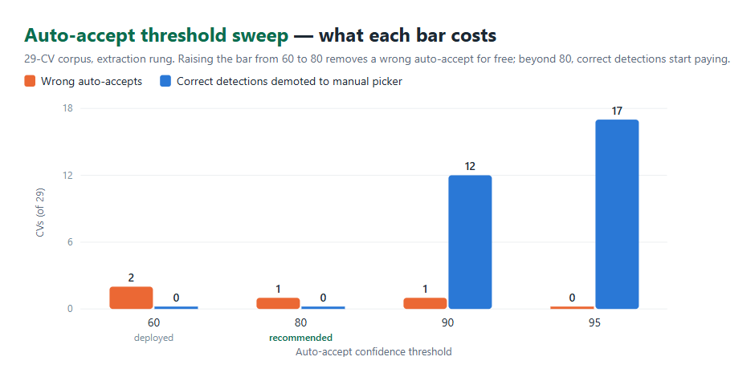
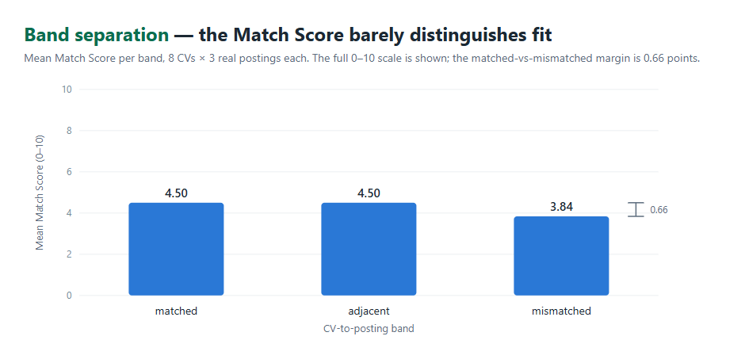

# 5. Results and Analysis

Every number in this chapter comes from one audited measurement campaign, run
against the final system after code freeze; the raw outputs and the harness
scripts are part of the repository. We measured three engines — the role-detection
pipeline (model 2 and its ladder), the market model (model 1), and the LLM scoring
agent — and we report what the instruments showed, including the two places where
they showed weakness.

## 5.1 Experimental Setup

**Corpus.** The evaluation corpus is the 32-file authentic-CV set of Section 4.4:
29 English CVs with ground-truth labels across nine scenario types, plus three
negative fixtures (two Hebrew CVs and one scanned image) that a well-behaved
system must reject rather than misclassify. All detection results below were
produced through the **full production path** — a real multipart PDF upload,
text extraction, then the detection ladder — never by calling a model directly,
because the user experiences the pipeline, not the classifier.

**Environment.** The DS server's ranking behavior is environment-driven, and the
measurement configuration is pinned and disclosed: a skill-ubiquity cap of 11, a
minimum-prevalence floor of 0.05, the agreement signal enabled, the retrained
model-1 artifact, and the backend's deployed thresholds (LLM fallback at 55,
frontend auto-accept at 60). Because the DS server exposes no configuration
endpoint, the configuration was verified *behaviorally*: a harness script
compares live server output against what each candidate configuration produces
offline from the model artifact, and the configurations disagree visibly (under
the defaults, `Software Engineer`'s top-five skills include `nice` and `git`;
under the measured configuration they do not). Any deployment that does not set
these variables will not reproduce these numbers — an operational fact we flag
rather than bury.

**Scoring-agent set.** For the Match Score, 8 authentic CVs were each paired with
three **real job postings** (17 distinct postings drawn from the 41,745-posting
corpus, each reviewed and approved by the annotator before use) in three
deliberate bands: *matched* (posting title equals the CV's role), *adjacent*
(neighbouring family, e.g. Backend × Data Engineer), and *mismatched* (unrelated,
e.g. Frontend × Cyber Security) — 24 pairs, 240 skill ratings. Three approved
postings carry a headline title that differs from their corpus label (two *Data
Scientist*-labeled postings are titled "Data Engineer", one *QA Automation* is
titled "QA Engineer (Manual)"); the labels were reviewed and kept, so the band
overlap reported in §5.2 is an upper bound on the confusion attributable to the
model.

## 5.2 Presentation of Results

### Role detection: the full pipeline

| Metric | Result |
|---|---|
| **Top-1 accuracy** | **26/29 (89.7%)** |
| **Top-3 accuracy** | **27/29 (93.1%)** |
| Pipeline errors | 0 |
| Negative fixtures correctly blocked | 3/3 |

The precise claim matters: on the full pipeline, over the 29 positive CVs of
this evaluation corpus, Top-1 accuracy was 89.7%. The corpus is authored, labeled
by a single annotator, and spans nine scenario types without covering all 59
roles evenly — so this is a corpus result, not a per-role guarantee across the
taxonomy.

Per scenario, Top-1 was perfect on ambiguous (4/4), career-changer (3/3), hybrid
(3/3) and niche-core (5/5) CVs; clear-cut profiles scored 8/9, junior CVs 2/3,
and unsupported-occupation CVs 1/2 — where "correct" for an unsupported CV means
the system declined to auto-accept any role.

The headline number, however, is a property of the *ladder*, not of any single
model — the decomposition by rung makes this concrete:

| Rung | n | Top-1 | Confidence scale |
|---|---|---|---|
| `title_extraction` (declared title → normalizer) | 26 | 92.3% | cosine similarity × 100 |
| `cv_classifier` (TF-IDF+MLP over the CV body) | 3 | 66.7% | renormalized softmax share |

**26 of the 29 CVs never reach the classifier** (the three that do are too few
to support a rate of their own and are reported for completeness). Measured in
isolation on this corpus, the classifier path alone reaches 55.2% — consistent
with its component-level accuracy on scrubbed held-out data (Chapter 3) — a
world apart from the 89.7% the user experiences on the same corpus. On this
evidence, the system's accuracy is a property of its architecture. Because
several nearby percentages measure different things, we fix their meanings once:

| Number | What it measures |
|---|---|
| 57.6% | Logistic-regression baseline, scrubbed held-out split (component) |
| 62.3% | Deployed MLP classifier, same scrubbed held-out split (component) |
| 55.2% | Classifier path alone, on this 29-CV corpus |
| **89.7%** | **The full detection ladder, on this 29-CV corpus** |

### Confidence calibration: one field, two incompatible scales

Both rungs emit a 0-100 confidence into the same field, judged against the same
frontend auto-accept threshold of 60 — but they are different distributions, so
we calibrated them separately (Figure 12).

On the extraction rung, the threshold sweep has a clean answer: raising
auto-accept from the deployed 60 to **80** costs zero correct detections and
removes the single wrong auto-accept in the corpus; above 80 the cost turns
steep (at 90, twelve correct detections are demoted to the manual picker).

| Auto-accept threshold | Auto-accepted | Wrong among them | Correct demoted to manual |
|---|---|---|---|
| 60 (deployed) | 27/29 | 2 | 0 |
| **80 (recommended)** | 26/29 | 1 | 0 |
| 90 | 14/29 | 1 | 12 |
| 95 | 8/29 | 0 | 17 |

*Figure 12 — Auto-accept threshold sweep on the 29-CV corpus: 80 removes a wrong auto-accept for free; beyond it, correct detections start paying the price.*

On the classifier rung, calibration fails outright: measured across all 29 CVs,
**no threshold separates right from wrong**. Confidences attached to *incorrect*
predictions range from 37.1 to 99.99, and even a 95 cut-off retains 21
predictions of which 7 are wrong. The classifier's confidence is not evidence of
its correctness — which is precisely why the agreement signal exists.

### The agreement signal, ablated

With the backend's decision rules replayed offline over direct classifier calls
(agreement ON versus OFF): accuracy 17/29 versus 16/29, one CV helped, none
harmed — a single-case signal observed on this corpus, reported as preliminary
evidence rather than an effect size. The single win is exactly the case the signal was built for — a
technical-writer CV (ground truth: no supported role) that the bare classifier
auto-accepted as *Product Manager* at confidence 75.8 was, with the signal on,
capped to 50 and routed to the manual picker. We disclose the counter-effect the
headline hides: on two CVs the `agree` branch lifted a wrong answer's confidence
past the auto-accept bar, converting "escalate to the LLM rung" into "auto-accept
the wrong title"; whether the LLM rung would have corrected them is unmeasured.

### Training coverage — and what absorbs it

Recomputed from the source corpora by replaying the repository's own mapping
functions (three conflicting counts circulated in older documents): **33 of the
59 canonical titles (56%) have zero real-CV training data** — the entire
security-research, hardware/VLSI and specialised-research space. The distribution
is binary: a title either has ≥100 real CVs or exactly none. The measured
consequence behaves exactly as predicted: on the classifier path, the FPGA and
malware-research fixtures are both misclassified as `C++ Developer`; through the
full ladder the same five niche-core CVs score **5/5**, because the declared-title
rung normalizes against all 59 titles regardless of classifier training data. The
coverage gap is real; the architecture, not the model, is what covers it.

### Determinism

The same CV uploaded five times returned identical titles and confidences on
every run, at both the sklearn layer and the full ladder (established on two CVs,
not proven in general). The scoring agent's non-determinism is measured
separately below.

### Model 1: first-ever quality figure

Under the blind merged-and-shuffled protocol of Section 4.4 (12 data-carrying
roles × top-10, 191 skills marked, 100% coverage):

| | precision@10 |
|---|---|
| **Live model** (retrained) | **97%** |
| Pre-retrain backup | 96% |

Two clarifications belong next to the number. First, the protocol: "live" is
the retrained model now in production, "backup" is its pre-retrain predecessor,
and the annotator saw one merged, shuffled list — blind to which model proposed
which skill. Second, the metric's scope: precision@10 measures whether a skill
is *relevant* to the role — not how useful it is to a candidate, how well it
reflects a trend, or whether the ten together are the best possible ten (§5.3
returns to this).

Only 8 of 191 skills were rejected, and they split cleanly by model — the
pre-retrain model's rejects are **cross-role contamination** (`backend` under
Frontend Developer and under Data Engineer, `python` under Java Developer,
`cybersecurity` under Product Manager: precisely the audit finding that
motivated the retrain), while the live model's rejects are vague-but-adjacent
(`computer science`, `tracking`, `writing`). The contamination class of error is
measurably absent from the live model.

### The scoring agent: stable, distinct — and weakly discriminative

Test-retest stability is excellent: re-scoring identical (CV, skill-list) pairs
through an endpoint that performs no skill re-selection, the mean per-skill
standard deviation is **0.11 points** (max 0.36) — at temperature 0.2 the score
moves by roughly a tenth of a point between runs.

Band separation is a different story (Figure 13):

| Band | Mean Match Score |
|---|---|
| matched | **4.50 / 10** |
| adjacent | **4.50 / 10** |
| mismatched | **3.84 / 10** |

Within-CV ordering (matched above mismatched) held for 6 of 8 CVs, with one tie
and one inversion; the mean margin is **0.66 points** on a 10-point scale.
Adjacent postings are indistinguishable from matched ones, and the single highest
score in the whole set (7.0) went to a Data Engineer CV against a *Data
Scientist* posting — above every correctly matched pair.

*Figure 13 — Band separation: matched, adjacent and mismatched postings receive nearly the same mean score; a 0.66-point margin separates matched from mismatched.*

Against the deterministic keyword-overlap fallback on the identical 240 ratings,
the LLM agrees within 2 points on only **119 of 240 (49.6%)** — it scores
markedly lower on average (4.28 vs 5.73) and assigns low scores to skills that
appear as bare keywords, exactly as its evidence-only prompt instructs. The agent
is clearly doing something other than keyword counting; whether that something is
*closer to human judgement* was deliberately left unmeasured (§5.5).

## 5.3 Data Analysis and Interpretation

Read together, the tables above reduce to three findings.

**The product's accuracy lives in the architecture, not in any model.** The
component-level classifier numbers (55-62%) and the system-level 89.7% are both
true; the gap between them is the declared-title rung resolving 26 of 29 CVs
before the classifier is ever consulted, and the same effect absorbs the 56%
training-coverage gap for niche roles. This validates the central design decision
of Chapter 3 — role detection as a ladder of mechanisms with disjoint failure
modes — more strongly than any single-model metric could.

**A confidence field is only as meaningful as its worst producer.** One UI
threshold judges two incompatible distributions. On the extraction rung the
signal is well-behaved and the sweep yields a free improvement (60 → 80, adopted
as a recommendation, not applied during the measurement freeze); on
the classifier rung no threshold works at all, and correctness has to come from
elsewhere. This is the measured justification for the final design's
second-opinion mechanism: where a confidence number cannot be trusted, the
agreement of two independently trained models can. The ablation
shows the mechanism working as designed, at small measurable benefit and with a
disclosed, unmeasured risk on two CVs.

**An aggregate metric can hide the finding.** Model 1's +0.8pp looks like noise
until the errors are read qualitatively: the retrain traded wrong-family errors
for vague-but-adjacent ones — a change in *kind* that precision@10 is
structurally almost blind to, since the annotation protocol counts a generic but
genuine skill as relevant. The instrument measures relevance; the retrain
targeted informativeness; the flat aggregate is therefore expected, and the
per-error analysis, not the average, carries the result.

The scoring agent's weak band separation is analyzed in §5.5, because its cause
turned out to be structural rather than statistical.

## 5.4 Comparison with Existing Approaches

Against the landscape of Chapter 2, CareerLens sits in a deliberate middle.
Keyword-matching ATS tooling [1][2] produces exactly the behavior our keyword
baseline reproduces — bare-mention counting, inflated by boilerplate — and the
measured 50% disagreement between that baseline and our evidence-based agent is
the quantitative version of the product's thesis: reading evidence is genuinely
different from counting words. Compared with end-to-end learned matchers such as
conSultantBERT [10], our detection stack is unapologetically shallower: a TF-IDF+MLP
component where linear-adjacent models suffice [7], sentence embeddings where
semantics are required [8][9], and LLM judgment only at the two points where
neither statistics nor embeddings can decide (reading a declared title out of
messy text; assessing evidence for a skill). The system-level result — 89.7%
through the ladder versus 55-62% for the strongest single component — supports
composing cheap components over training one heavy one, at least at our data
scale, where fine-tuning a transformer end-to-end was never on the table for
lack of labeled CVs (56% of our own taxonomy has no real training data at all).
The same comparison clarifies what CareerLens is not: a chat prompt. A
general-purpose LLM asked to "review my CV" brings no market model, no
accumulated posting history, no closed role taxonomy, and no per-skill evidence
contract; its answer shifts with each phrasing and cites no data. CareerLens
spends LLM judgment only at two guarded points inside a measured pipeline, and
everything around those points is reproducible.

## 5.5 Discussion of Findings

**What the Match Score actually measures.** Tracing the scoring path end-to-end
produced the campaign's most consequential finding: the scoring agent receives
**only the CV text and the ten skill names** — the job description never enters
the scoring prompt. The posting decides *which* skills are scored, upstream; it
plays no part in *how* they are scored. The weak band separation of Figure 13 is
therefore structural, not a prompt-wording defect: the scorer cannot distinguish
a matched posting from a mismatched one because it never sees the posting. On
this evidence, the Match Score behaves more like a *CV-quality score over
job-relevant skills* than a CV-to-job fit score — a mischaracterization in our
own UI copy, and we say so here. The 0.11-point test-retest σ shows the
weakness is not sampling noise (the band margin is six times the run-to-run
variance), and the fix — passing posting context into the scoring prompt, then
re-measuring band separation — is concrete, bounded future work.

**What was not measured — the evaluation's most significant open item.**
Agreement between the scoring agent and human judgement (MAE, Spearman ρ, ±2
share) was not measured: the blind annotation sheet was built and verified (29
items totaling 290 human ratings — the human-side counterpart of the 240 machine
ratings in §5.2), but the session did not fit the submission timeline. This is a
real validity gap, not a footnote: without a human reference we cannot establish
whether the agent's scores are correct, whether the fit bands match human
perception, or whether the rewrite suggestions actually improve a CV. What the
label-free measurements establish — stability (σ = 0.11), structural behavior,
and material divergence from keyword counting (50% disagreement) — are necessary
conditions for validity, not proof of it. Running the prepared session is the
first order of business in future work.

**Limitations.** Seven bounds apply to every number above. (1) Ground truth for
model 1's relevance was labeled by a single annotator — mitigated by blind,
shuffled presentation, but inter-annotator agreement cannot be computed. (1a) The
scoring agent has no human reference at all, per the decision above. (2) 33 of 59
titles have no real-CV training data, so classifier performance on them is
unmeasurable directly — and poor where measured indirectly. (3) The evaluation
set is small: 29 scored CVs, with per-scenario cells of 2-9 — those percentages
are indicative, not precise. (4) The fixtures are authored and independently
reviewed, not harvested from real applicants. (5) The scoring agent is
non-deterministic by construction; its variance is reported, not hidden. (6) The
job-posting corpus is Ukrainian (Djinni, 2019-2023) with heuristically assigned
labels — not the Israeli market, and not current; sampled postings were
hand-checked before use. (7) Every number is conditional on the disclosed serving
configuration (§5.1); a deployment on the DS server's defaults will not reproduce
them.
